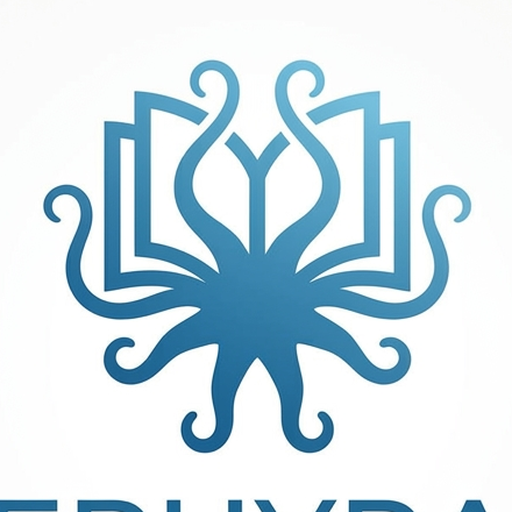

# Ephyra

### Personal media reader with Jellyfin integration
Organize, track, and read your personal manga, comics, and webtoon collections — with Jellyfin server sync so you can manage your library once and read everywhere on your Android device.

> **⚠️ This is an unofficial fork. It is not affiliated with, endorsed by, or connected to the [mihonapp/mihon](https://github.com/mihonapp/mihon) project or its team.**

## Download

*Requires Android 8.0 or higher.*

## About

Ephyra is a personal media reader and library manager for Android, built for people who own their content. Whether your collection lives on a Jellyfin server, on your phone's local storage, or elsewhere, Ephyra helps you organize, track, and read it all in one place.

**Core philosophy:** *Your content, your library, your way.* Ephyra is designed for self-hosters and personal media collectors who want a polished reading experience with powerful organization and tracking tools.

**Key differentiators:**
- Full Jellyfin server integration — track read progress, sync libraries, and manage content on your self-hosted media server.
- Authority-based metadata — discover and pair series with authoritative metadata sources for rich library organization.
- Smart content source matching — intelligently find and deduplicate content sources, prioritizing sources with actual available chapters.

## Improvements over upstream

The following enhancements have been made on top of the base Mihon project:

- **Device-adaptive reader performance.** Preload window sizes and download worker counts are scaled automatically based on available device RAM, so low-end devices stay conservative while high-end devices prefetch more aggressively.
- **Bandwidth-isolated chapter preloading.** Adjacent chapters are fetched in the background using a single throttled worker, preventing speculative preloads from competing with the active chapter's downloads. Worker concurrency scales up only when that chapter becomes the one being read.
- **Opportunistic cross-chapter image prefetch.** When the current chapter's download buffer has headroom, the first pages of the next chapter begin downloading before the user reaches the chapter boundary, reducing wait time at transitions.
- **Per-page preload re-trigger.** If a cross-chapter prefetch was deferred due to a thin buffer, it is retried on every page advance rather than waiting for the next full preload cycle, so downloads start the moment bandwidth is available.
- **Backward page preloading.** Pages behind the current reading position are also queued for download at low priority, reducing stutter when navigating backward through a chapter.
- **Automatic retry with exponential backoff.** Transient page-load failures (network I/O errors, HTTP 429 and server errors) are retried up to three times with increasing delays before the page is marked as failed.
- **Smart page combine.** When a page is followed by a short watermark or credit stub, the two are automatically merged vertically into a single view. A background pre-scan merges already-loaded pages the moment a chapter is opened, and a per-page retry job fires automatically when the stub finishes loading after the main page is already on screen — so the merge is invisible to the reader in the common case.
- **Memory-safe page handling.** Each merged result is cached as a byte array on the page object and written directly into an Okio Buffer on subsequent renders, eliminating redundant stream copies, disk reads, and network calls for pages that have already been merged. Background merge and decode jobs are tied to the page holder's coroutine scope, which is cancelled and cleared the moment the view detaches from the window.

## Features

* Read content from your personal library — local files on your device, your Jellyfin media server, or other personal collections.
* A configurable reader with multiple viewers, reading directions and other settings.
* Jellyfin server integration: track read progress, sync libraries, and manage content on your self-hosted server.
* Tracker support: [MyAnimeList](https://myanimelist.net/), [AniList](https://anilist.co/), [Kitsu](https://kitsu.app/), [MangaUpdates](https://mangaupdates.com), [Shikimori](https://shikimori.one), [Bangumi](https://bgm.tv/), and [Jellyfin](https://jellyfin.org/).
* Categories to organize your library.
* Light and dark themes.
* Schedule updating your library for new chapters.
* Create backups locally or to your desired cloud service.
* Plus much more...

## Contributing

[Code of conduct](./CODE_OF_CONDUCT.md) · [Contributing guide](./CONTRIBUTING.md)

Pull requests are welcome. For major changes, please open an issue first to discuss what you would like to change.

Before reporting a new issue, take a look at the already opened [issues](https://github.com/Gameaday/Ephyra/issues).

### Credits

Thank you to all the people who have contributed to the upstream Mihon project and this fork!

### Disclaimer

This is an unofficial fork of Mihon and is **not affiliated with the Mihon Open Source Project**. Ephyra is the identity of this fork. The developer(s) of this application do not have any affiliation with the content providers available, and this application hosts zero content. Ephyra is intended for use with content you personally own or have authorized access to.

### License

<pre>
Copyright © 2015 Javier Tomás
Copyright © 2024 Mihon Open Source Project

Licensed under the Apache License, Version 2.0 (the "License");
you may not use this file except in compliance with the License.
You may obtain a copy of the License at

http://www.apache.org/licenses/LICENSE-2.0

Unless required by applicable law or agreed to in writing, software
distributed under the License is distributed on an "AS IS" BASIS,
WITHOUT WARRANTIES OR CONDITIONS OF ANY KIND, either express or implied.
See the License for the specific language governing permissions and
limitations under the License.
</pre>

